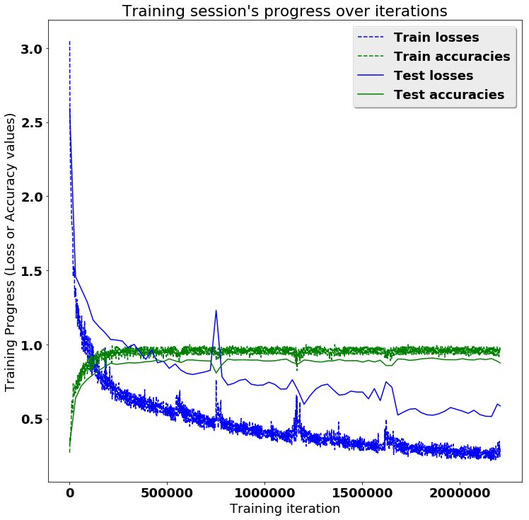

# LSTMs for Human Activity Recognition

Human activity recognition using smartphones dataset and an LSTM RNN. Classifying the type of movement amongst six categories:
- WALKING,
- WALKING_UPSTAIRS,
- WALKING_DOWNSTAIRS,
- SITTING,
- STANDING,
- LAYING.

Compared to a classical approach, using a Recurrent Neural Networks (RNN) with Long Short-Term Memory cells (LSTMs) require no or almost no feature engineering. Data can be fed directly into the neural network who acts like a black box, modeling the problem correctly. Other research on the activity recognition dataset used mostly use a big amount of feature engineering, which is rather a signal processing approach combined with classical data science techniques. The approach here is rather very simple in terms of how much did the data was preprocessed. 

## Video dataset overview

Follow this link to see a video of the 6 activities recorded in the experiment with one of the participants:

<p align="center">
  <a href="http://www.youtube.com/watch?feature=player_embedded&v=XOEN9W05_4A
" target="_blank"></a>
  <a href="https://youtu.be/XOEN9W05_4A"><center>[Watch video]</center></a>
</p>

## Details about input data

I will be using an LSTM on the data to learn (as a cellphone attached on the waist) to recognise the type of activity that the user is doing. The dataset's description goes like this:

> The sensor signals (accelerometer and gyroscope) were pre-processed by applying noise filters and then sampled in fixed-width sliding windows of 2.56 sec and 50% overlap (128 readings/window). The sensor acceleration signal, which has gravitational and body motion components, was separated using a Butterworth low-pass filter into body acceleration and gravity. The gravitational force is assumed to have only low frequency components, therefore a filter with 0.3 Hz cutoff frequency was used. 

That said, I will use the almost raw data: only the gravity effect has been filtered out of the accelerometer  as a preprocessing step for another 3D feature as an input to help learning. 

## What is an RNN?

As explained in [this article](http://karpathy.github.io/2015/05/21/rnn-effectiveness/), an RNN takes many input vectors to process them and output other vectors. It can be roughly pictured like in the image below, imagining each rectangle has a vectorial depth and other special hidden quirks in the image below. **In our case, the "many to one" architecture is used**: we accept time series of feature vectors (one vector per time step) to convert them to a probability vector at the output for classification. Note that a "one to one" architecture would be a standard feedforward neural network. 


An LSTM is an improved RNN. It is more complex, but easier to train, avoiding what is called the vanishing gradient problem. 


## Results 

Scroll on! Nice visuals awaits. 


```python
# All Includes

import numpy as np
import matplotlib
import matplotlib.pyplot as plt
import tensorflow as tf  # Version 1.0.0 (some previous versions are used in past commits)
from sklearn import metrics

import os
```


```python
# Useful Constants

# Those are separate normalised input features for the neural network
INPUT_SIGNAL_TYPES = [
    "body_acc_x_",
    "body_acc_y_",
    "body_acc_z_",
    "body_gyro_x_",
    "body_gyro_y_",
    "body_gyro_z_",
    "total_acc_x_",
    "total_acc_y_",
    "total_acc_z_"
]

# Output classes to learn how to classify
LABELS = [
    "WALKING", 
    "WALKING_UPSTAIRS", 
    "WALKING_DOWNSTAIRS", 
    "SITTING", 
    "STANDING", 
    "LAYING"
] 

```

## Let's start by downloading the data: 


```python
# Note: Linux bash commands start with a "!" inside those "ipython notebook" cells

DATA_PATH = "data/"

!pwd && ls
os.chdir(DATA_PATH)
!pwd && ls

!python download_dataset.py

!pwd && ls
os.chdir("..")
!pwd && ls

DATASET_PATH = DATA_PATH + "UCI HAR Dataset/"
print("\n" + "Dataset is now located at: " + DATASET_PATH)

```

    /home/cadu/notebook/LSTM-Human-Activity-Recognition-master
    data  LICENSE  LSTM_files  LSTM.ipynb  lstm.py	README.md
    /home/cadu/notebook/LSTM-Human-Activity-Recognition-master/data
    download_dataset.py  __MACOSX  source.txt  UCI HAR Dataset  UCI HAR Dataset.zip
    
    Downloading...
    Dataset already downloaded. Did not download twice.
    
    Extracting...
    Dataset already extracted. Did not extract twice.
    
    /home/cadu/notebook/LSTM-Human-Activity-Recognition-master/data
    download_dataset.py  __MACOSX  source.txt  UCI HAR Dataset  UCI HAR Dataset.zip
    /home/cadu/notebook/LSTM-Human-Activity-Recognition-master
    data  LICENSE  LSTM_files  LSTM.ipynb  lstm.py	README.md
    
    Dataset is now located at: data/UCI HAR Dataset/


## Preparing dataset:


```python
TRAIN = "train/"
TEST = "test/"


# Load "X" (the neural network's training and testing inputs)

def load_X(X_signals_paths):
    X_signals = []
    
    for signal_type_path in X_signals_paths:
        file = open(signal_type_path, 'r')
        # Read dataset from disk, dealing with text files' syntax
        X_signals.append(
            [np.array(serie, dtype=np.float32) for serie in [
                row.replace('  ', ' ').strip().split(' ') for row in file
            ]]
        )
        file.close()
    
    return np.transpose(np.array(X_signals), (1, 2, 0))

X_train_signals_paths = [
    DATASET_PATH + TRAIN + "Inertial Signals/" + signal + "train.txt" for signal in INPUT_SIGNAL_TYPES
]
X_test_signals_paths = [
    DATASET_PATH + TEST + "Inertial Signals/" + signal + "test.txt" for signal in INPUT_SIGNAL_TYPES
]

X_train = load_X(X_train_signals_paths) 
print(X_train.shape,len(X_train))   # 7352 128 9
X_test = load_X(X_test_signals_paths)


# Load "y" (the neural network's training and testing outputs)

def load_y(y_path):
    file = open(y_path, 'r')
    # Read dataset from disk, dealing with text file's syntax
    y_ = np.array(
        [elem for elem in [
            row.replace('  ', ' ').strip().split(' ') for row in file
        ]], 
        dtype=np.int32
    )
    file.close()
    
    # Substract 1 to each output class for friendly 0-based indexing 
    return y_ - 1            #return y_-1 

y_train_path = DATASET_PATH + TRAIN + "y_train.txt"
y_test_path = DATASET_PATH + TEST + "y_test.txt"

y_train = load_y(y_train_path)
print('y_train.shape|len:',y_train.shape,len(y_train))   # 7352 1
y_test = load_y(y_test_path)

n_values = int(np.max(y_train)) + 1
print(n_values)
```

    (7352, 128, 9) 7352
    y_train.shape|len: (7352, 1) 7352
    6


## Additionnal Parameters:

Here are some core parameter definitions for the training. 

The whole neural network's structure could be summarised by enumerating those parameters and the fact an LSTM is used. 


```python
# Input Data 

training_data_count = len(X_train)  # 7352 training series (with 50% overlap between each serie)
test_data_count = len(X_test)  # 2947 testing series
n_steps = len(X_train[0])  # 128 timesteps per series
n_input = len(X_train[0][0])  # 9 input parameters per timestep


# LSTM Neural Network's internal structure

n_hidden = 32 # Hidden layer num of features
n_classes = 6 # Total classes (should go up, or should go down)


# Training 

learning_rate = 0.0025
lambda_loss_amount = 0.0015
training_iters = training_data_count * 300  # Loop 300 times on the dataset
batch_size = 1500
display_iter = 30000  # To show test set accuracy during training


# Some debugging info

print("Some useful info to get an insight on dataset's shape and normalisation:")
print("(X shape, y shape, every X's mean, every X's standard deviation)")
print(X_test.shape, y_test.shape, np.mean(X_test), np.std(X_test))
print("The dataset is therefore properly normalised, as expected, but not yet one-hot encoded.")

```

    Some useful info to get an insight on dataset's shape and normalisation:
    (X shape, y shape, every X's mean, every X's standard deviation)
    (2947, 128, 9) (2947, 1) 0.0991399 0.395671
    The dataset is therefore properly normalised, as expected, but not yet one-hot encoded.


## Utility functions for training:


```python
def LSTM_RNN(_X, _weights, _biases):
    # Function returns a tensorflow LSTM (RNN) artificial neural network from given parameters. 
    # Moreover, two LSTM cells are stacked which adds deepness to the neural network. 
    # Note, some code of this notebook is inspired from an slightly different 
    # RNN architecture used on another dataset, some of the credits goes to 
    # "aymericdamien" under the MIT license.

    # (NOTE: This step could be greatly optimised by shaping the dataset once
    # input shape: (batch_size, n_steps, n_input)
    _X = tf.transpose(_X, [1, 0, 2])  # permute n_steps and batch_size   _X(128,7352,9)
    # Reshape to prepare input to hidden activation   
    _X = tf.reshape(_X, [-1, n_input])                                 #_X (128*7352,9) 
    # new shape: (n_steps*batch_size, n_input)
    
    # Linear activation
    _X = tf.nn.relu(tf.matmul(_X, _weights['hidden']) + _biases['hidden'])  #  (128*7352,9)*(9,32)---->(128*7352,32)
    # Split data because rnn cell needs a list of inputs for the RNN inner loop
    _X = tf.split(_X, n_steps, 0)     #(_x ,128,0)--->128 *(7352,32)          /input _X is a batch_size(1500)
    # new shape: n_steps * (batch_size, n_hidden)                             /so all 7352 will be instead by 1500

    # Define two stacked LSTM cells (two recurrent layers deep) with tensorflow
    lstm_cell_1 = tf.contrib.rnn.BasicLSTMCell(n_hidden, forget_bias=1.0, state_is_tuple=True)
    lstm_cell_2 = tf.contrib.rnn.BasicLSTMCell(n_hidden, forget_bias=1.0, state_is_tuple=True)
    #return a list of variables same
    lstm_cells = tf.contrib.rnn.MultiRNNCell([lstm_cell_1, lstm_cell_2], state_is_tuple=True)
    # use a two-layers' lstm,the output of the first layer as the input of the second layer
    # MultiRNNCell n_steps
    # return a list of variables
    # Get LSTM cell output
    outputs, states = tf.contrib.rnn.static_rnn(lstm_cells, _X, dtype=tf.float32)

    # **Get last time step's output feature for a "many to one" style classifier, 
    # as in the image describing RNNs at the top of this page**
    lstm_last_output = outputs[-1]
    
    # Linear activation
    #                                   [n_hidden ,n_classes]    [n_classes]
    return tf.matmul(lstm_last_output, _weights['out']) + _biases['out']# the last output matmul


def extract_batch_size(_train, step, batch_size):
    # Function to fetch a "batch_size" amount of data from "(X|y)_train" data. 
    
    shape = list(_train.shape) #_X  7352 128 9
    shape[0] = batch_size      # 1500 128 9
    batch_s = np.empty(shape)

    for i in range(batch_size):
        # Loop index
        index = ((step-1)*batch_size + i) % len(_train) # step=1 
        batch_s[i] = _train[index] 

    return batch_s


def one_hot(y_):
    # Function to encode output labels from number indexes 
    # e.g.: [[5], [0], [3]] --> [[0, 0, 0, 0, 0, 1], [1, 0, 0, 0, 0, 0], [0, 0, 0, 1, 0, 0]]
    
    y_ = y_.reshape(len(y_))
    n_values = int(np.max(y_)) + 1
    #print(n_values)
    return np.eye(n_values)[np.array(y_, dtype=np.int32)]  # Returns FLOATS

```

## Let's get serious and build the neural network:


```python

# Graph input/output
x = tf.placeholder(tf.float32, [None, n_steps, n_input]) # none 128 9
y = tf.placeholder(tf.float32, [None, n_classes]) # none 6

# Graph weights
weights = {
    'hidden': tf.Variable(tf.random_normal([n_input, n_hidden])), # Hidden layer weights  9 32
    'out': tf.Variable(tf.random_normal([n_hidden, n_classes], mean=1.0)) # 32 6
}
biases = {
    'hidden': tf.Variable(tf.random_normal([n_hidden])),# 32
    'out': tf.Variable(tf.random_normal([n_classes]))  #6
}

pred = LSTM_RNN(x, weights, biases)

# Loss, optimizer and evaluation
l2 = lambda_loss_amount * sum(  #0.0015*sum
    tf.nn.l2_loss(tf_var) for tf_var in tf.trainable_variables() #fan hui xu yao xun lian de bianliang liebiao
) # L2 loss prevents this overkill neural network to overfit the data
cost = tf.reduce_mean(tf.nn.softmax_cross_entropy_with_logits(labels=y, logits=pred)) + l2 # Softmax loss
optimizer = tf.train.AdamOptimizer(learning_rate=learning_rate).minimize(cost) # Adam Optimizer

correct_pred = tf.equal(tf.argmax(pred,1), tf.argmax(y,1))
accuracy = tf.reduce_mean(tf.cast(correct_pred, tf.float32))

```

## Hooray, now train the neural network:


```python
# To keep track of training's performance
test_losses = []
test_accuracies = []
train_losses = []
train_accuracies = []

# Launch the graph
sess = tf.InteractiveSession(config=tf.ConfigProto(log_device_placement=True))
init = tf.global_variables_initializer()
sess.run(init)

# Perform Training steps with "batch_size" amount of example data at each loop
step = 1
while step * batch_size <= training_iters:    # 1*1500 <7352*300
    batch_xs =         extract_batch_size(X_train, step, batch_size)# (1500,128,9)
    batch_ys = one_hot(extract_batch_size(y_train, step, batch_size))#[[100000],,,,[000001]]

    # Fit training using batch data
    _, loss, acc = sess.run(
        [optimizer, cost, accuracy],
        feed_dict={
            x: batch_xs, 
            y: batch_ys
        }
    )
    train_losses.append(loss)
    train_accuracies.append(acc)
    
    # Evaluate network only at some steps for faster training: 
    if (step*batch_size % display_iter == 0) or (step == 1) or (step * batch_size > training_iters):
        
        # To not spam console, show training accuracy/loss in this "if"
        print("Training iter #" + str(step*batch_size) + \
              ":   Batch Loss = " + "{:.6f}".format(loss) + \
              ", Accuracy = {}".format(acc))
        
        # Evaluation on the test set (no learning made here - just evaluation for diagnosis)
        loss, acc = sess.run(
            [cost, accuracy], 
            feed_dict={
                x: X_test,
                y: one_hot(y_test)
            }
        )
        test_losses.append(loss)
        test_accuracies.append(acc)
        print("PERFORMANCE ON TEST SET: " + \
              "Batch Loss = {}".format(loss) + \
              ", Accuracy = {}".format(acc))

    step += 1

print("Optimization Finished!")

# Accuracy for test data

one_hot_predictions, accuracy, final_loss = sess.run(
    [pred, accuracy, cost],
    feed_dict={
        x: X_test,
        y: one_hot(y_test)
    }
)

test_losses.append(final_loss)
test_accuracies.append(accuracy)

print("FINAL RESULT: " + \
      "Batch Loss = {}".format(final_loss) + \
      ", Accuracy = {}".format(accuracy))

```

    Training iter #1500:   Batch Loss = 3.046139, Accuracy = 0.27000001072883606
    PERFORMANCE ON TEST SET: Batch Loss = 2.5928597450256348, Accuracy = 0.3267729878425598
    Training iter #30000:   Batch Loss = 1.375967, Accuracy = 0.671999990940094
    PERFORMANCE ON TEST SET: Batch Loss = 1.4588730335235596, Accuracy = 0.6372582316398621
    Training iter #60000:   Batch Loss = 1.135147, Accuracy = 0.7540000081062317
    PERFORMANCE ON TEST SET: Batch Loss = 1.3718318939208984, Accuracy = 0.7207329273223877
    Training iter #90000:   Batch Loss = 0.969816, Accuracy = 0.8619999885559082
    PERFORMANCE ON TEST SET: Batch Loss = 1.28568434715271, Accuracy = 0.7641669511795044
    Training iter #120000:   Batch Loss = 0.829078, Accuracy = 0.9120000004768372
    PERFORMANCE ON TEST SET: Batch Loss = 1.1644043922424316, Accuracy = 0.7957244515419006
    Training iter #150000:   Batch Loss = 0.751132, Accuracy = 0.9333333373069763
    PERFORMANCE ON TEST SET: Batch Loss = 1.1190061569213867, Accuracy = 0.8249067068099976
    Training iter #180000:   Batch Loss = 0.818872, Accuracy = 0.8840000033378601
    PERFORMANCE ON TEST SET: Batch Loss = 1.0803322792053223, Accuracy = 0.8493382930755615
    Training iter #210000:   Batch Loss = 0.752040, Accuracy = 0.921999990940094
    PERFORMANCE ON TEST SET: Batch Loss = 1.033172369003296, Accuracy = 0.873430609703064
    Training iter #240000:   Batch Loss = 0.648599, Accuracy = 0.9553333520889282
    PERFORMANCE ON TEST SET: Batch Loss = 1.029225468635559, Accuracy = 0.8649473786354065
    Training iter #270000:   Batch Loss = 0.623133, Accuracy = 0.9633333086967468
    PERFORMANCE ON TEST SET: Batch Loss = 1.0221328735351562, Accuracy = 0.8707159757614136
    Training iter #300000:   Batch Loss = 0.587068, Accuracy = 0.987333357334137
    PERFORMANCE ON TEST SET: Batch Loss = 0.977746844291687, Accuracy = 0.8764845728874207
    Training iter #330000:   Batch Loss = 0.623599, Accuracy = 0.9660000205039978
    PERFORMANCE ON TEST SET: Batch Loss = 1.0007057189941406, Accuracy = 0.8747879266738892
    Training iter #360000:   Batch Loss = 0.632795, Accuracy = 0.9493333101272583
    PERFORMANCE ON TEST SET: Batch Loss = 0.9461649060249329, Accuracy = 0.876823902130127
    Training iter #390000:   Batch Loss = 0.637552, Accuracy = 0.9380000233650208
    PERFORMANCE ON TEST SET: Batch Loss = 0.8984891176223755, Accuracy = 0.8829317688941956
    Training iter #420000:   Batch Loss = 0.619690, Accuracy = 0.9399999976158142
    PERFORMANCE ON TEST SET: Batch Loss = 0.9624437093734741, Accuracy = 0.8853070735931396
    Training iter #450000:   Batch Loss = 0.564227, Accuracy = 0.9513333439826965
    PERFORMANCE ON TEST SET: Batch Loss = 0.8762362599372864, Accuracy = 0.894808292388916
    Training iter #480000:   Batch Loss = 0.564212, Accuracy = 0.9386666417121887
    PERFORMANCE ON TEST SET: Batch Loss = 0.886859655380249, Accuracy = 0.8842890858650208
    Training iter #510000:   Batch Loss = 0.526148, Accuracy = 0.9586666822433472
    PERFORMANCE ON TEST SET: Batch Loss = 0.8384560346603394, Accuracy = 0.9019341468811035
    Training iter #540000:   Batch Loss = 0.541933, Accuracy = 0.9413333535194397
    PERFORMANCE ON TEST SET: Batch Loss = 0.8677793145179749, Accuracy = 0.8893790245056152
    Training iter #570000:   Batch Loss = 0.596010, Accuracy = 0.9353333115577698
    PERFORMANCE ON TEST SET: Batch Loss = 0.8258982300758362, Accuracy = 0.8775025606155396
    Training iter #600000:   Batch Loss = 0.577550, Accuracy = 0.9273333549499512
    PERFORMANCE ON TEST SET: Batch Loss = 0.8040071725845337, Accuracy = 0.894808292388916
    Training iter #630000:   Batch Loss = 0.463709, Accuracy = 0.981333315372467
    PERFORMANCE ON TEST SET: Batch Loss = 0.7969251275062561, Accuracy = 0.8951476216316223
    Training iter #660000:   Batch Loss = 0.452985, Accuracy = 0.984666645526886
    PERFORMANCE ON TEST SET: Batch Loss = 0.8053773641586304, Accuracy = 0.8910756707191467
    Training iter #690000:   Batch Loss = 0.423903, Accuracy = 0.9993333220481873
    PERFORMANCE ON TEST SET: Batch Loss = 0.8134006857872009, Accuracy = 0.8893790245056152
    Training iter #720000:   Batch Loss = 0.497540, Accuracy = 0.9539999961853027
    PERFORMANCE ON TEST SET: Batch Loss = 0.8250685334205627, Accuracy = 0.8883610367774963
    Training iter #750000:   Batch Loss = 0.502515, Accuracy = 0.940666675567627
    PERFORMANCE ON TEST SET: Batch Loss = 1.229499340057373, Accuracy = 0.8072616457939148
    Training iter #780000:   Batch Loss = 0.444858, Accuracy = 0.9593333601951599
    PERFORMANCE ON TEST SET: Batch Loss = 0.7808219194412231, Accuracy = 0.8632507920265198
    Training iter #810000:   Batch Loss = 0.443345, Accuracy = 0.9580000042915344
    PERFORMANCE ON TEST SET: Batch Loss = 0.7256187200546265, Accuracy = 0.9012554883956909
    Training iter #840000:   Batch Loss = 0.454498, Accuracy = 0.9393333196640015
    PERFORMANCE ON TEST SET: Batch Loss = 0.7372950315475464, Accuracy = 0.8944689631462097
    Training iter #870000:   Batch Loss = 0.417529, Accuracy = 0.9646666646003723
    PERFORMANCE ON TEST SET: Batch Loss = 0.7577982544898987, Accuracy = 0.8958262801170349
    Training iter #900000:   Batch Loss = 0.397277, Accuracy = 0.9713333249092102
    PERFORMANCE ON TEST SET: Batch Loss = 0.7652127742767334, Accuracy = 0.8958262801170349
    Training iter #930000:   Batch Loss = 0.448466, Accuracy = 0.9386666417121887
    PERFORMANCE ON TEST SET: Batch Loss = 0.7310356497764587, Accuracy = 0.8941296339035034
    Training iter #960000:   Batch Loss = 0.450775, Accuracy = 0.9326666593551636
    PERFORMANCE ON TEST SET: Batch Loss = 0.7239092588424683, Accuracy = 0.894808292388916
    Training iter #990000:   Batch Loss = 0.373480, Accuracy = 0.9553333520889282
    PERFORMANCE ON TEST SET: Batch Loss = 0.7257364988327026, Accuracy = 0.8887003660202026
    Training iter #1020000:   Batch Loss = 0.377260, Accuracy = 0.9693333506584167
    PERFORMANCE ON TEST SET: Batch Loss = 0.7449337244033813, Accuracy = 0.8876823782920837
    Training iter #1050000:   Batch Loss = 0.356906, Accuracy = 0.9646666646003723
    PERFORMANCE ON TEST SET: Batch Loss = 0.7299947738647461, Accuracy = 0.8897183537483215
    Training iter #1080000:   Batch Loss = 0.384343, Accuracy = 0.9746666550636292
    PERFORMANCE ON TEST SET: Batch Loss = 0.6983342170715332, Accuracy = 0.8961656093597412
    Training iter #1110000:   Batch Loss = 0.418423, Accuracy = 0.9399999976158142
    PERFORMANCE ON TEST SET: Batch Loss = 0.6995744705200195, Accuracy = 0.9009161591529846
    Training iter #1140000:   Batch Loss = 0.432187, Accuracy = 0.9380000233650208
    PERFORMANCE ON TEST SET: Batch Loss = 0.7612832188606262, Accuracy = 0.8781812191009521
    Training iter #1170000:   Batch Loss = 0.494048, Accuracy = 0.918666660785675
    PERFORMANCE ON TEST SET: Batch Loss = 0.6871683597564697, Accuracy = 0.8680013418197632
    Training iter #1200000:   Batch Loss = 0.377275, Accuracy = 0.9480000138282776
    PERFORMANCE ON TEST SET: Batch Loss = 0.5960143804550171, Accuracy = 0.894808292388916
    Training iter #1230000:   Batch Loss = 0.359446, Accuracy = 0.949999988079071
    PERFORMANCE ON TEST SET: Batch Loss = 0.6526904106140137, Accuracy = 0.8907363414764404
    Training iter #1260000:   Batch Loss = 0.332621, Accuracy = 0.9806666374206543
    PERFORMANCE ON TEST SET: Batch Loss = 0.6982999444007874, Accuracy = 0.8832710981369019
    Training iter #1290000:   Batch Loss = 0.362164, Accuracy = 0.9453333616256714
    PERFORMANCE ON TEST SET: Batch Loss = 0.7225067615509033, Accuracy = 0.8812351822853088
    Training iter #1320000:   Batch Loss = 0.420562, Accuracy = 0.9246666431427002
    PERFORMANCE ON TEST SET: Batch Loss = 0.7314850091934204, Accuracy = 0.8887003660202026
    Training iter #1350000:   Batch Loss = 0.343700, Accuracy = 0.9606666564941406
    PERFORMANCE ON TEST SET: Batch Loss = 0.6932310461997986, Accuracy = 0.8890396952629089
    Training iter #1380000:   Batch Loss = 0.311714, Accuracy = 0.9779999852180481
    PERFORMANCE ON TEST SET: Batch Loss = 0.6574826836585999, Accuracy = 0.898201584815979
    Training iter #1410000:   Batch Loss = 0.300392, Accuracy = 0.9853333234786987
    PERFORMANCE ON TEST SET: Batch Loss = 0.6630662679672241, Accuracy = 0.8897183537483215
    Training iter #1440000:   Batch Loss = 0.331289, Accuracy = 0.9826666712760925
    PERFORMANCE ON TEST SET: Batch Loss = 0.6846107244491577, Accuracy = 0.8897183537483215
    Training iter #1470000:   Batch Loss = 0.346553, Accuracy = 0.9539999961853027
    PERFORMANCE ON TEST SET: Batch Loss = 0.6782659888267517, Accuracy = 0.8903970122337341
    Training iter #1500000:   Batch Loss = 0.364437, Accuracy = 0.9386666417121887
    PERFORMANCE ON TEST SET: Batch Loss = 0.6783574223518372, Accuracy = 0.8802171945571899
    Training iter #1530000:   Batch Loss = 0.298560, Accuracy = 0.9620000123977661
    PERFORMANCE ON TEST SET: Batch Loss = 0.6328838467597961, Accuracy = 0.8920936584472656
    Training iter #1560000:   Batch Loss = 0.306240, Accuracy = 0.9513333439826965
    PERFORMANCE ON TEST SET: Batch Loss = 0.7017652988433838, Accuracy = 0.8812351822853088
    Training iter #1590000:   Batch Loss = 0.315663, Accuracy = 0.9446666836738586
    PERFORMANCE ON TEST SET: Batch Loss = 0.6205817461013794, Accuracy = 0.8931116461753845
    Training iter #1620000:   Batch Loss = 0.356509, Accuracy = 0.9513333439826965
    PERFORMANCE ON TEST SET: Batch Loss = 0.7481029033660889, Accuracy = 0.8574821949005127
    Training iter #1650000:   Batch Loss = 0.375123, Accuracy = 0.903333306312561
    PERFORMANCE ON TEST SET: Batch Loss = 0.7104079723358154, Accuracy = 0.8574821949005127
    Training iter #1680000:   Batch Loss = 0.373479, Accuracy = 0.9293333292007446
    PERFORMANCE ON TEST SET: Batch Loss = 0.5231311321258545, Accuracy = 0.9012554883956909
    Training iter #1710000:   Batch Loss = 0.362014, Accuracy = 0.9313333630561829
    PERFORMANCE ON TEST SET: Batch Loss = 0.5439850687980652, Accuracy = 0.900237500667572
    Training iter #1740000:   Batch Loss = 0.285215, Accuracy = 0.972000002861023
    PERFORMANCE ON TEST SET: Batch Loss = 0.5624274015426636, Accuracy = 0.8924329876899719
    Training iter #1770000:   Batch Loss = 0.276742, Accuracy = 0.9853333234786987
    PERFORMANCE ON TEST SET: Batch Loss = 0.5667766332626343, Accuracy = 0.8954869508743286
    Training iter #1800000:   Batch Loss = 0.254053, Accuracy = 0.9766666889190674
    PERFORMANCE ON TEST SET: Batch Loss = 0.5394861698150635, Accuracy = 0.9022734761238098
    Training iter #1830000:   Batch Loss = 0.315575, Accuracy = 0.9539999961853027
    PERFORMANCE ON TEST SET: Batch Loss = 0.524972677230835, Accuracy = 0.9056667685508728
    Training iter #1860000:   Batch Loss = 0.318760, Accuracy = 0.940666675567627
    PERFORMANCE ON TEST SET: Batch Loss = 0.5223846435546875, Accuracy = 0.9077027440071106
    Training iter #1890000:   Batch Loss = 0.287151, Accuracy = 0.9539999961853027
    PERFORMANCE ON TEST SET: Batch Loss = 0.5315871238708496, Accuracy = 0.9019341468811035
    Training iter #1920000:   Batch Loss = 0.258267, Accuracy = 0.9559999704360962
    PERFORMANCE ON TEST SET: Batch Loss = 0.5489769577980042, Accuracy = 0.8968442678451538
    Training iter #1950000:   Batch Loss = 0.284219, Accuracy = 0.9493333101272583
    PERFORMANCE ON TEST SET: Batch Loss = 0.5739759206771851, Accuracy = 0.8965049386024475
    Training iter #1980000:   Batch Loss = 0.275937, Accuracy = 0.9473333358764648
    PERFORMANCE ON TEST SET: Batch Loss = 0.5619362592697144, Accuracy = 0.8961656093597412
    Training iter #2010000:   Batch Loss = 0.226445, Accuracy = 0.9779999852180481
    PERFORMANCE ON TEST SET: Batch Loss = 0.5505492687225342, Accuracy = 0.9032914638519287
    Training iter #2040000:   Batch Loss = 0.327481, Accuracy = 0.9293333292007446
    PERFORMANCE ON TEST SET: Batch Loss = 0.5346068143844604, Accuracy = 0.8965049386024475
    Training iter #2070000:   Batch Loss = 0.315670, Accuracy = 0.9306666851043701
    PERFORMANCE ON TEST SET: Batch Loss = 0.5557237267494202, Accuracy = 0.8951476216316223
    Training iter #2100000:   Batch Loss = 0.227302, Accuracy = 0.9879999756813049
    PERFORMANCE ON TEST SET: Batch Loss = 0.5264102220535278, Accuracy = 0.9026128053665161
    Training iter #2130000:   Batch Loss = 0.230666, Accuracy = 0.9693333506584167
    PERFORMANCE ON TEST SET: Batch Loss = 0.5152657628059387, Accuracy = 0.8975229263305664
    Training iter #2160000:   Batch Loss = 0.221473, Accuracy = 0.9766666889190674
    PERFORMANCE ON TEST SET: Batch Loss = 0.5137479305267334, Accuracy = 0.9046487808227539
    Training iter #2190000:   Batch Loss = 0.238385, Accuracy = 0.984666645526886
    PERFORMANCE ON TEST SET: Batch Loss = 0.5977090001106262, Accuracy = 0.885646402835846
    Optimization Finished!
    FINAL RESULT: Batch Loss = 0.5851481556892395, Accuracy = 0.8744485974311829


## Training is good, but having visual insight is even better:

Okay, let's plot this simply in the notebook for now.


```python
# (Inline plots: )
%matplotlib inline

font = {
    'family' : 'Bitstream Vera Sans',
    'weight' : 'bold',
    'size'   : 18
}
matplotlib.rc('font', **font)

width = 12
height = 12
plt.figure(figsize=(width, height))

indep_train_axis = np.array(range(batch_size, (len(train_losses)+1)*batch_size, batch_size))
plt.plot(indep_train_axis, np.array(train_losses),     "b--", label="Train losses")
plt.plot(indep_train_axis, np.array(train_accuracies), "g--", label="Train accuracies")

indep_test_axis = np.append(
    np.array(range(batch_size, len(test_losses)*display_iter, display_iter)[:-1]),
    [training_iters]
)
plt.plot(indep_test_axis, np.array(test_losses),     "b-", label="Test losses")
plt.plot(indep_test_axis, np.array(test_accuracies), "g-", label="Test accuracies")

plt.title("Training session's progress over iterations")
plt.legend(loc='upper right', shadow=True)
plt.ylabel('Training Progress (Loss or Accuracy values)')
plt.xlabel('Training iteration')

plt.show()
```

    /home/cadu/anaconda3/lib/python3.6/site-packages/matplotlib/font_manager.py:1297: UserWarning: findfont: Font family ['Bitstream Vera Sans'] not found. Falling back to DejaVu Sans
      (prop.get_family(), self.defaultFamily[fontext]))





## And finally, the multi-class confusion matrix and metrics!


```python
# Results

predictions = one_hot_predictions.argmax(1)

print("Testing Accuracy: {}%".format(100*accuracy))

print("")
print("Precision: {}%".format(100*metrics.precision_score(y_test, predictions, average="weighted")))
print("Recall: {}%".format(100*metrics.recall_score(y_test, predictions, average="weighted")))
print("f1_score: {}%".format(100*metrics.f1_score(y_test, predictions, average="weighted")))

print("")
print("Confusion Matrix:")
confusion_matrix = metrics.confusion_matrix(y_test, predictions)
print(confusion_matrix)
normalised_confusion_matrix = np.array(confusion_matrix, dtype=np.float32)/np.sum(confusion_matrix)*100

print("")
print("Confusion matrix (normalised to % of total test data):")
print(normalised_confusion_matrix)
print("Note: training and testing data is not equally distributed amongst classes, ")
print("so it is normal that more than a 6th of the data is correctly classifier in the last category.")

# Plot Results: 
width = 12
height = 12
plt.figure(figsize=(width, height))
plt.imshow(
    normalised_confusion_matrix, 
    interpolation='nearest', 
    cmap=plt.cm.rainbow
)
plt.title("Confusion matrix \n(normalised to % of total test data)")
plt.colorbar()
tick_marks = np.arange(n_classes)
plt.xticks(tick_marks, LABELS, rotation=90)
plt.yticks(tick_marks, LABELS)
plt.tight_layout()
plt.ylabel('True label')
plt.xlabel('Predicted label')
plt.show()
```

    Testing Accuracy: 87.44485974311829%
    
    Precision: 88.42454847145535%
    Recall: 87.44485917882592%
    f1_score: 87.20719693343977%
    
    Confusion Matrix:
    [[419  25  52   0   0   0]
     [  6 419  46   0   0   0]
     [  4   0 416   0   0   0]
     [  0  25   0 307 159   0]
     [  0  16   0  37 479   0]
     [  0   0   0   0   0 537]]
    
    Confusion matrix (normalised to % of total test data):
    [[ 14.21784878   0.84832031   1.76450634   0.           0.           0.        ]
     [  0.20359688  14.21784878   1.56090939   0.           0.           0.        ]
     [  0.13573125   0.          14.11605072   0.           0.           0.        ]
     [  0.           0.84832031   0.          10.41737366   5.39531755   0.        ]
     [  0.           0.542925     0.           1.25551414  16.2538166    0.        ]
     [  0.           0.           0.           0.           0.          18.22192001]]
    Note: training and testing data is not equally distributed amongst classes, 
    so it is normal that more than a 6th of the data is correctly classifier in the last category.


```python
sess.close()
```

## Conclusion

Outstandingly, **the final accuracy is of 91%**! And it can peak to values such as 92.73%, at some moments of luck during the training, depending on how the neural network's weights got initialized at the start of the training, randomly. 

This means that the neural networks is almost always able to correctly identify the movement type! Remember, the phone is attached on the waist and each series to classify has just a 128 sample window of two internal sensors (a.k.a. 2.56 seconds at 50 FPS), so those predictions are extremely accurate.

I specially did not expect such good results for guessing between "SITTING" and "STANDING". Those are seemingly almost the same thing from the point of view of a device placed at waist level according to how the dataset was gathered. Thought, it is still possible to see a little cluster on the matrix between those classes, which drifts away from the identity. This is great.

It is also possible to see that there was a slight difficulty in doing the difference between "WALKING", "WALKING_UPSTAIRS" and "WALKING_DOWNSTAIRS". Obviously, those activities are quite similar in terms of movements. 

I also tried my code without the gyroscope, using only the two 3D accelerometer's features (and not changing the training hyperparameters), and got an accuracy of 87%. In general, gyroscopes consumes more power than accelerometers, so it is preferable to turn them off. 


## Improvements

In [another open-source repository of mine](https://github.com/guillaume-chevalier/HAR-stacked-residual-bidir-LSTMs), the accuracy is pushed up to 94% using a special deep LSTM architecture which combines the concepts of bidirectional RNNs, residual connections and stacked cells. This architecture is also tested on another similar activity dataset. It resembles to the architecture used in "[Google’s Neural Machine Translation System: Bridging the Gap between Human and Machine Translation](https://arxiv.org/pdf/1609.08144.pdf)" without an attention mechanism and with just the encoder part - still as a "many to one" architecture which is adapted to the Human Activity Recognition (HAR) problem.

If you want to learn more about deep learning, I have also built a list of the learning ressources for deep learning which have revealed to be the most useful to me [here](https://github.com/guillaume-chevalier/awesome-deep-learning-resources). You could as well learn to [learn to learn by gradient descent by gradient descent](https://arxiv.org/pdf/1606.04474.pdf) (not for the faint of heart). Ok, I pushed the joke deep enough... 


## References

The [dataset](https://archive.ics.uci.edu/ml/datasets/Human+Activity+Recognition+Using+Smartphones) can be found on the UCI Machine Learning Repository. 

> Davide Anguita, Alessandro Ghio, Luca Oneto, Xavier Parra and Jorge L. Reyes-Ortiz. A Public Domain Dataset for Human Activity Recognition Using Smartphones. 21th European Symposium on Artificial Neural Networks, Computational Intelligence and Machine Learning, ESANN 2013. Bruges, Belgium 24-26 April 2013.

To cite my work, point to the URL of the GitHub repository: 
> Guillaume Chevalier, LSTMs for Human Activity Recognition, 2016
> https://github.com/guillaume-chevalier/LSTM-Human-Activity-Recognition

My code is available under the [MIT License](https://github.com/guillaume-chevalier/LSTM-Human-Activity-Recognition/blob/master/LICENSE). 

## Connect with me

- https://ca.linkedin.com/in/chevalierg 
- https://twitter.com/guillaume_che
- https://github.com/guillaume-chevalier/


```python
# Let's convert this notebook to a README for the GitHub project's title page:
!jupyter nbconvert --to markdown LSTM.ipynb
!mv LSTM.md README.md
```
